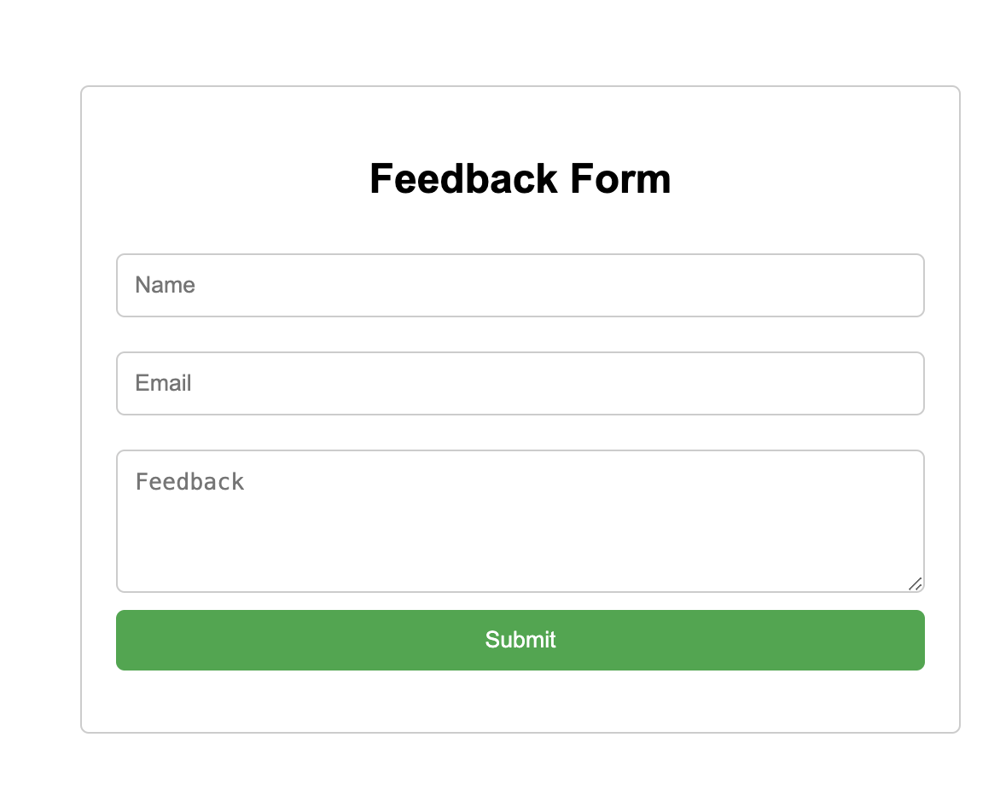

# Secure Feedback Collection


## Introduction
The Secure Feedback Project is a linux php application that collects feedback from people. It uses sso for user authentication and also includes server, application and network monitoring. It features load balancing to manage traffic amongst the servers.


## Installation

### Requirements
- Apache
- MySQL
- PHP
- SSO
- HAProxy

### Setup & Usage
- **After cloning the repo, install and initialise the database**

    - Install MySQL.
    ```
    sudo apt install mysql-server
    ```

    - Secure MySQL and follow the prompt
    ```
    sudo mysql_secure_installation
    ```
    - Login to the sql server
    ```
    sudo mysql
    ```
    - Setup a database:
    ```sql
    CREATE DATABASE databaseName;
    CREATE USER 'userName'@'localhost' IDENTIFIED BY 'Username';
    GRANT ALL PRIVILEGES ON databaseName.* TO 'userName'@'localhost';
    FLUSH PRIVILEGES;
    ```
    - Login to MySql with the new user data, add password when prompted
    ```
    mysql -u userName -p
    ```
    - Create table in MySQL
    ```sql
    USE databaseName;
    CREATE TABLE IF NOT EXISTS feedback (
    id INT AUTO_INCREMENT PRIMARY KEY,
    name VARCHAR(255) NOT NULL,
    email VARCHAR(255) NOT NULL,
    feedback TEXT NOT NULL,
    created_at TIMESTAMP DEFAULT CURRENT_TIMESTAMP);
    ```


- **Install and Initialise Appache**
    - Installation of Apache.
    ```
    sudo apt install apache2 -y
    sudo systemctl enable apache2
    sudo systemctl start apache2
    ```

    -  Duplicte the cloned contents in [index.html](index.html) to `/var/www/html`.

    ```
    sudo cp index.html /var/www/html
    ```
    - Visit localhost on your browser to view the html file.

    

- **Install and Initialise PHP and Composer**
    - Install PHP and its configs:
    ```
    sudo apt install php libapache2-mod-php php-mysql php-curl -y
    ```
    - Create PHP files to handle OKTA Authentication
        - Copy [sso.php](sso.php) to `/var/www/html` directory. 
        ```
        sudo cp sso.php /var/www/html # sso.php handles response from OKTA after user has successfully logged in.
        ```
        - Copy [index.php](index.php) to `/var/www/html` directory. 
        ```
        sudo cp index.php /var/www/html  # index.php serves as entry point of our application. It typically initiates the OKTA authentication process.
        ```
        - Copy [feedback.php](feedback.php) to `/var/www/htl` directory.
        ```
        sudo cp feedback.php /var/www/html # This sends response back to user - feedback successfully submitted
        ```

        - Navigate to `/var/www/html` and install composer
        ```
       cd /var/www/html
       sudo apt install composer
       ```
       - Install Okta's jwt verifier with composer
         
        ```
        sudo composer require okta/jwt-verifier
        ```

- **SSO Installation**
    - Create an okta Auth0 account and follow the propmts to set up a new application. Remember to set the sign-in redirect url and sign out redirect url. Copy your client secret, client id and your okta domain. Replace your values in `sso.php` and `index.php` with your copied values for client secret, client id and your okta domain.

        
7. **Installation and Initialisation of the Load Balancer**
    - Install HAProxy on your load balancer server
    ```
    sudo apt install haproxy -y
    ```
    - Create a backup HAProxy file
    ```
    sudo cp /etc/haproxy/haproxy.cfg /etc/haproxy/haproxy.cfg.old
    ```
    - Modify the configuration file with the IP address of your first 2 servers
    ```
    frontend main
            bind *:80
            stats uri /haproxy?stats 
            default_backend app

    backend app
            balance         roundrobin 
            server  server1 ServerA-ip:80   check 
            server  server2 ServerB-ip:80   check 

    ```

    - Validate your config file, this step should anytime your restart your haproxy
    ```
    haproxy -c -f /etc/haproxy/haproxy.cfg
    ```
   
    - Start and Enable HAProxy
    ```
    sudo systemctl enable haproxy
	sudo systemctl start haproxy
    ```
    - Test your load balancer by loading the IP address of the server in your browser.
    - To view the monitor your load balancer. In your browser Open a new tab on your web browser to check the statistics and health of your webservers and type `http://IP_ADDRESS_OF_YOUR_SERVER/haproxy?stats`
   
    - Restart HAProxy anytime you modify the .cfg file
	```
    sudo systemctl restart haproxy
    ```
 
